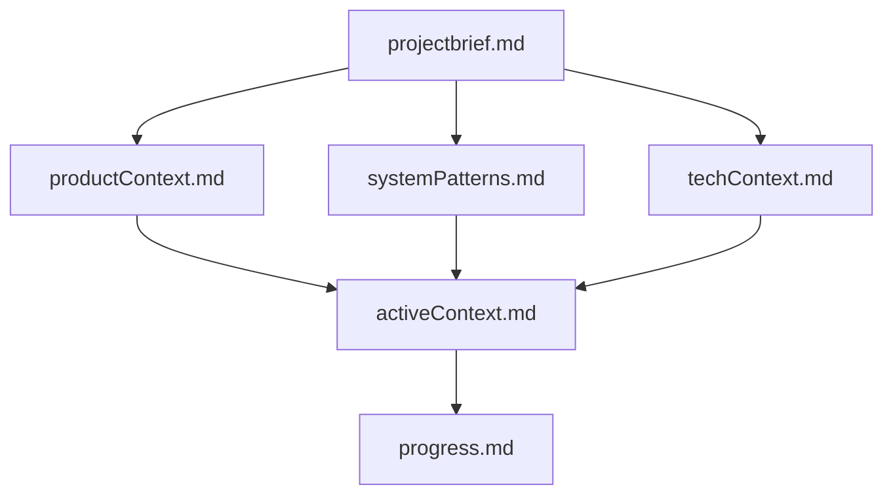

# Memory Bank Setup Complete

## Overview
The Memory Bank system has been successfully established for ClipForge, providing comprehensive project context that will persist across AI sessions. This system follows the structured approach outlined in the Memory Bank documentation.

## Created Files

### Core Memory Bank Files
- **`memory-bank/projectbrief.md`** - Foundation document with project overview, deadlines, and requirements
- **`memory-bank/productContext.md`** - User needs, market positioning, and success metrics
- **`memory-bank/systemPatterns.md`** - Architecture patterns and design principles
- **`memory-bank/techContext.md`** - Technology stack and development environment
- **`memory-bank/activeContext.md`** - Current work focus and immediate next steps
- **`memory-bank/progress.md`** - Implementation status and what needs to be built

### Project Intelligence (.cursor/rules/)
- **`.cursor/rules/base.mdc`** - Core project rules and development principles
- **`.cursor/rules/frontend.mdc`** - Frontend component standards and patterns
- **`.cursor/rules/main-process.mdc`** - Electron main process rules and patterns

## Memory Bank Structure

The Memory Bank follows the hierarchical structure as designed:

## Key Information Captured

### Project Context
- **72-hour sprint** with strict deadlines (MVP: Tuesday 10:59 PM CT, Final: Wednesday 10:59 PM CT)
- **Desktop video editor** using Electron + React + TypeScript
- **Core workflow**: Record → Import → Arrange → Export
- **Target users**: Content creators, educators, developers

### Technical Foundation
- **Stack**: Electron 39.0.0, React 19.2.0, TypeScript 5.9.3, Redux Toolkit
- **Build**: Vite with electron-vite
- **Styling**: Tailwind CSS
- **Testing**: Vitest + Playwright
- **Media**: FFmpeg via fluent-ffmpeg

### Current Status
- **Phase**: Pre-development setup complete
- **Progress**: 5% (setup complete, core features pending)
- **Next**: Begin MVP implementation with basic Electron window

### Architecture Decisions
- **Multi-process**: Main process for system operations, renderer for UI
- **State Management**: Redux Toolkit with slice-based organization
- **IPC Communication**: Channel-based with request-response pattern
- **Security**: Context isolation, no node integration in renderer

## Development Guidelines

### Core Principles
1. **Velocity over perfection** - 72-hour constraint requires focused development
2. **MVP first** - Complete MVP before adding advanced features
3. **Test-driven** - Write tests alongside implementation
4. **User-centric** - Focus on core user workflow

### Quality Standards
- **TypeScript strict mode** - No `any` types
- **Performance targets** - Timeline responsive with 10+ clips, 30fps preview
- **Error handling** - Graceful degradation and user-friendly messages
- **Security** - Electron security best practices

## Next Steps

### Immediate Actions
1. **Begin MVP Development** - Start with basic Electron window
2. **Implement Core Features** - Focus on MVP requirements
3. **Test Early and Often** - Implement tests alongside features
4. **Monitor Progress** - Track progress against deadlines

### Development Priority
1. **Basic Electron Window** (Next 2-4 hours)
2. **React App Structure** (Next 2-4 hours)
3. **File Import System** (Next 4-6 hours)
4. **Media Library UI** (Next 4-6 hours)
5. **Timeline Foundation** (Next 6-8 hours)

## Success Metrics

### MVP Success Criteria
- [ ] App launches successfully
- [ ] Can import MP4/MOV files
- [ ] Timeline displays imported clips
- [ ] Video preview plays clips
- [ ] Basic trim functionality works
- [ ] Can export to MP4
- [ ] App packages as native .app

### Performance Targets
- [ ] Timeline responsive with 10+ clips
- [ ] Preview smooth at 30fps
- [ ] Export completes without crashes
- [ ] App launches in under 5 seconds
- [ ] No memory leaks in 15+ minute sessions

## Usage Instructions

### For AI Sessions
1. **Read Memory Bank** - Start every session by reading all Memory Bank files
2. **Check Active Context** - Review current work focus and next steps
3. **Update Progress** - Document changes and progress made
4. **Follow Rules** - Apply project intelligence from .cursor/rules/

### For Development
1. **Follow Patterns** - Use established architectural patterns
2. **Maintain Quality** - Follow coding standards and best practices
3. **Test Continuously** - Write tests alongside implementation
4. **Document Decisions** - Record architectural decisions and rationale

## Benefits

### Context Preservation
- **Complete project context** available across all AI sessions
- **No information loss** between sessions
- **Consistent understanding** of project goals and constraints

### Development Efficiency
- **Clear guidelines** for development approach
- **Established patterns** for common tasks
- **Quality standards** for consistent output

### Project Success
- **Focused development** on MVP requirements
- **Quality foundation** for rapid feature development
- **Comprehensive testing** strategy for reliability

## Maintenance

### Regular Updates
- **Progress tracking** - Update progress.md with implementation status
- **Decision documentation** - Record architectural decisions
- **Issue tracking** - Document challenges and solutions
- **Context updates** - Keep activeContext.md current

### Session Transitions
- **Review Memory Bank** - Read all files at session start
- **Update documentation** - Document progress and decisions
- **Prepare next session** - Clear next steps and priorities

The Memory Bank system is now ready to support efficient AI collaboration throughout the ClipForge development process. All project context, technical decisions, and development guidelines are preserved and accessible for future sessions.
